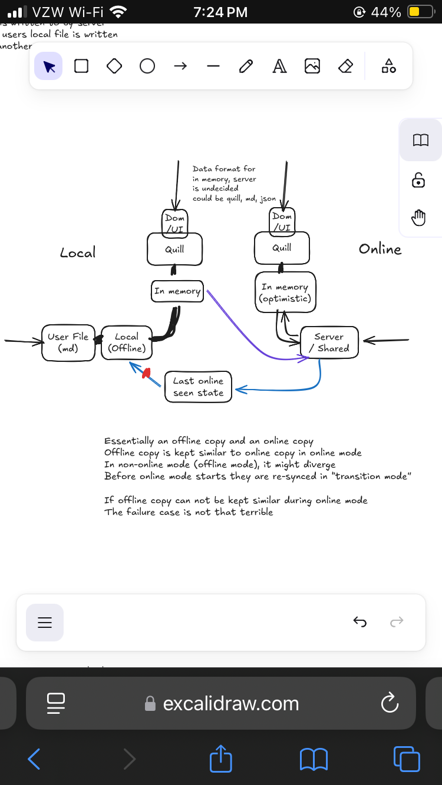

basically, maybe we can separate the online ans offline state into 2 modules
then we can just use an out of the box thing like yjs for the online state
    -   I was going to make something fully custom, but maybe I shouldn't, maybe its easier & faster to do something like just use yjs and make a custom sync provider that does e2ee
yjs specifically is not good enough imo to merge changes with it from offline (I think we need to loop the user in to resolve big enough conflicts) (see this blog post (not mine) https://www.moment.dev/blog/lies-i-was-told-pt-1 ), so we can just do that manually in a separate layer and just encode it as new changes
